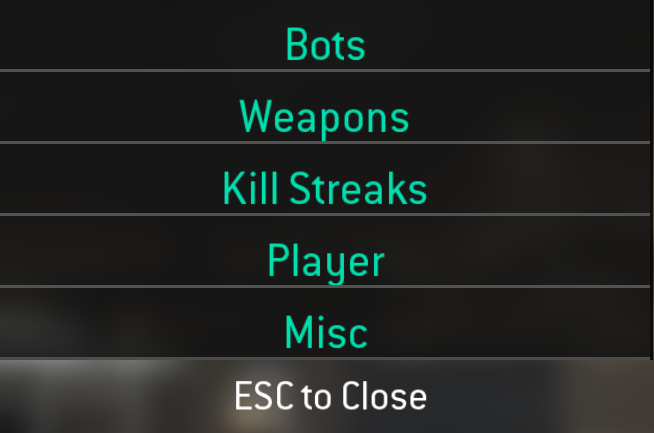

<h1 align="center">
   
  Cod4 Editing Mod Beta
   
</h1>

<h4 align="center">The Best Cod4 Mod For Faking Frags and Editing</a>!</h4>

  

<a href="https://youtube.com/kruumy"><strong>Watch The Trailer »</strong></a>
   

  <a href="#features">Features</a> •
  <a href="#support">Support</a> •
  <a href="#installation">Installation</a> •
  <a href="#todo">Todo</a> •
  <a href="#credits">Credits</a>

  

## Features

* In-game Menu
* Cod4 Better Anims
* Pezbot Mod
* MW2 Death Money FX 
* Quick Devmap Menu
* Lots of Custom Weapons
* Give Killstreak Dvar
* Single-Player Map Mod
* In-game Player Model Changer 
* Custom Player Models
* HQ Models & Texture Replacements
* Killcams and Final Killcams
* Aimbot & EB
* Avery's Bot Mod
* And More!

## Support

| Name | Status |
| --- | --- |
| COD4 1.7 | No |
| [IW3xo](https://github.com/xoxor4d/iw3xo-dev) | Yes |
| [COD4x](https://cod4x.me/) | No |

*The mod on stock Cod4 and Cod4x exceeds the 128 weapons asset limit and 1000 xmodel limit. Probably could work if u delete some of the custom weapons but just use iw3xo anyway it's better.*

## Installation

1. Download the latest version from releases.
2. Extract and put the folder in the cod4 mod directory.
3. Done!

Note: **Ads + Knifing** Opens The In-Game Menu.

## Todo

* Fix killstreaks sometimes not working.
* Add drop weapons death mod.
* Fix leg bug on death anims.
* Replace heli model with mw3 heli model.
* Add more custom models to the change model menu.
* Add rain dvar to give anymap rain.
* Fix SP maps not working.
* Fix postions on the menu.
* Add EB.
* Add button to increase player damage to make one shot.
* Add rpg bullets.
* Add hud popups when enabling things in the menu.
* Make trailer and make banner.
* Make aimbot actually toggle

## Credits

This mod is a collection of many mods found from various sources and my own modifications:

- [soon](omg.com)
---

